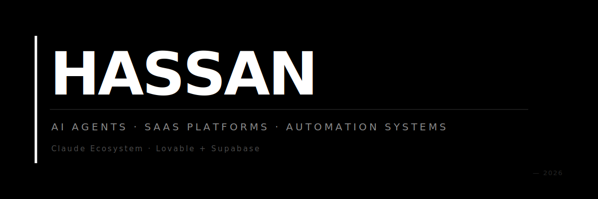

---

## About

I build AI agents, SaaS platforms, and automation systems. 30+ apps, systems, and workflows shipped.

I've been writing code professionally since 2015 and building AI systems since before ChatGPT existed. 43 machine learning projects delivered, plus consulting work building multi-agent AI systems with LangGraph, RAG, and GPT-4o deployed on AWS EKS.

I'm your main point of contact on every project. You talk to me on calls, I make the architecture decisions, and I'll tell you when something is a bad idea before you spend money on it. Behind me is a plethora of experience in QA, DevOps, and project management — with mature engineering practices: code reviews, automated testing, CI/CD pipelines, and AI-assisted quality checks baked into every sprint.

---

## What I Build

### 🤖 AI Agents & Chatbots
Custom AI agents, chatbots, and RAG systems trained on your data. AI voice agents using Retell and Vapi that answer inbound calls, qualify leads, and book appointments into CRMs. RAG pipelines that turn 200-page technical manuals into instant answers. GPT-powered chatbots integrated with Shopify that handle 80% of customer support questions without a human.

`Claude API` `OpenAI API` `GPT-4` `LangChain` `LangGraph` `Pinecone` `ChromaDB` `Retell` `Vapi` `ElevenLabs` `Supabase` `n8n`

### 🔧 Lovable, Replit & Bolt Rescue
Clients come to me with broken Lovable and Bolt prototypes that look good but don't actually work — auth failures, broken Supabase connections, no real backend logic, payment integration issues. I either fix them inside Lovable or rebuild them properly on Next.js + Supabase + FastAPI. I've productionized Lovable prototypes for field service management, telecom operations, and out-of-home advertising platforms.

### ⚡ Workflow Automation & AI Integration
I connect your tools so data flows without manual work. Lead routing, follow-up sequences, CRM logging, document processing, notifications — all automated end-to-end.

`n8n` `Make` `Zapier` `Custom API integrations`

### 🧠 AI Consulting & Claude Implementation
I help businesses figure out where AI actually fits in their operations and then build it. I work with Claude (Anthropic's API, Claude Code, Claude Cowork) to automate workflows that used to require entire teams: document processing, report generation, code reviews, data extraction, content pipelines, and internal knowledge bases.

If you're sitting on repetitive business processes and wondering how to use AI to cut 20+ hours/week, that's exactly what I consult on. I scope the opportunity, design the system, and my team builds it.

### 💻 Full-Stack SaaS & Web Applications
Production-grade SaaS platforms from zero to launch in 4–8 weeks. Dashboards, auth, payments, admin panels, real-time features, API integrations. Field service management platforms, LinkedIn prospecting tools, nutrition tracking apps, billboard management dashboards, AI-powered sales trainers.

`Next.js` `React` `Supabase` `FastAPI` `Node.js` `PostgreSQL` `Stripe`

### 🌐 Chrome Extensions & Web Automation
Browser extensions for WhatsApp automation, YouTube mood-based search, LinkedIn content analysis, and visual feedback tools. Plus data scraping and web automation systems.

---

## Tech Stack

**Languages** — TypeScript, JavaScript, Python

**Frontend** — Next.js, React, React Native, Tailwind CSS, Redux

**Backend** — Node.js, FastAPI, Django, GraphQL, REST

**Databases** — PostgreSQL, Supabase, MongoDB, Firebase

**AI / ML** — Claude API, OpenAI API, GPT-4, LangChain, LangGraph, Pinecone, ChromaDB

**Voice AI** — Retell, Vapi, ElevenLabs

**Automation** — n8n, Make, Zapier

**Infra** — Docker, AWS, Stripe, Git, GitHub

---

## Services

- AI Agent Development
- AI App Development
- SaaS Development
- Full-Stack Development
- AI Model Integration
- Generative AI
- ChatGPT API Integration
- Automated Workflow
- Back-End Development
